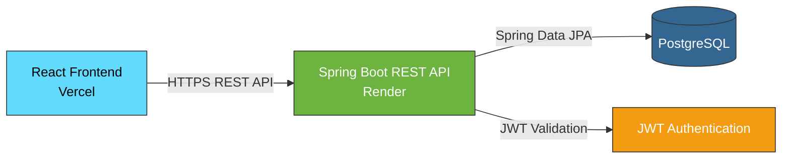
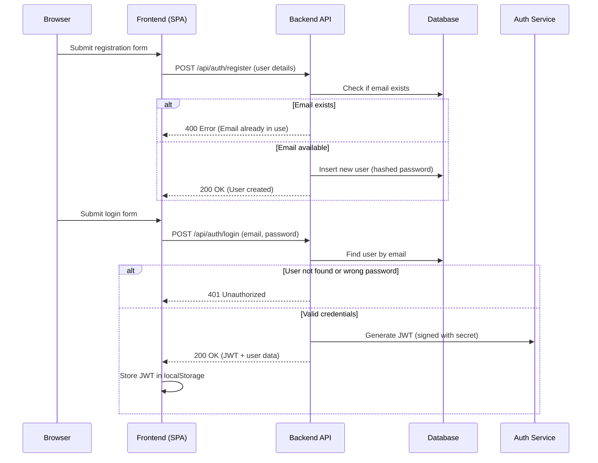
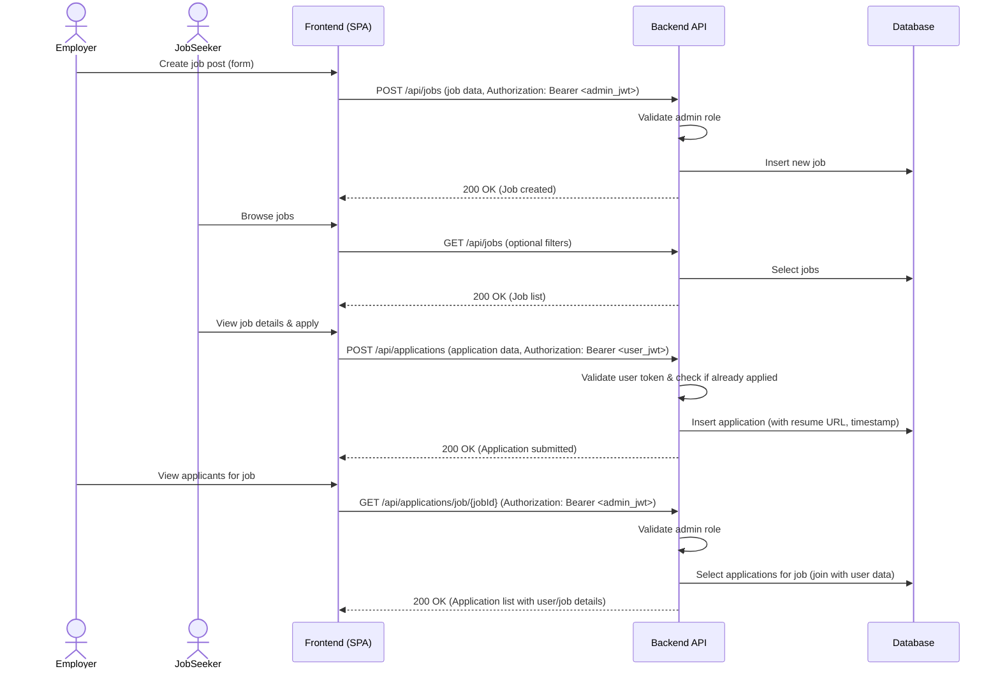
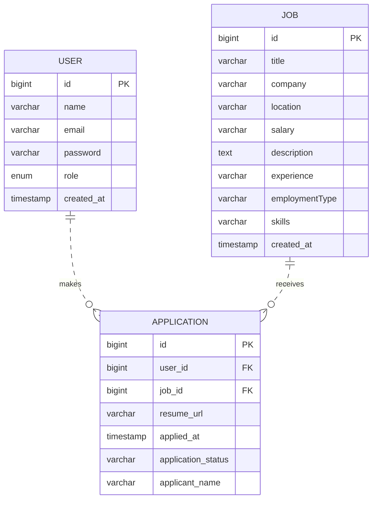

# CareerHub - Modern Job Board Platform

A full-stack job board application built with Spring Boot 3 and React, featuring JWT authentication, role-based access control, and responsive design.

## Table of Contents
- [Overview](#overview)
- [Features](#features)
- [Tech Stack](#tech-stack)
- [Architecture](#architecture)
- [Database Design](#database-design)
- [System Design](#system-design)
- [API Documentation](#api-documentation)
- [Getting Started](#getting-started)
- [Environment Variables](#environment-variables)
- [Deployment](#deployment)
- [CI/CD Pipeline](#cicd-pipeline)
- [Screenshots](#screenshots)
- [Future Improvements](#future-improvements)
- [License](#license)

## Overview

CareerHub is a comprehensive job portal where job seekers can browse and apply for positions, while employers can post and manage job listings. The platform implements modern security practices with JWT authentication and role-based access control (RBAC) to differentiate between regular users and administrators.

## Features

### User Features
- User registration and login with JWT authentication
- Browse and search job listings with filters
- View detailed job information
- Apply for jobs with resume upload
- View application history

### Employer/Admin Features
- Admin dashboard to manage job postings
- Create, update, and delete job listings
- View applicants for each job
- Application status management

### Technical Features
- RESTful API design with proper HTTP status codes
- Global exception handling
- Input validation with Bean Validation
- Password encryption using BCrypt
- Role-based access control (USER/Admin)
- Responsive design with Tailwind CSS
- Modern React hooks and context API
- Docker containerization
- CI/CD pipeline with GitHub Actions

## Tech Stack

### Backend
- **Language**: Java 21
- **Framework**: Spring Boot 3 (Spring Web, Spring Data JPA, Spring Security)
- **Database**: PostgreSQL
- **Authentication**: JWT (JSON Web Tokens) with BCrypt password encoding
- **Build Tool**: Maven
- **Validation**: Jakarta Validation (Bean Validation 3.0)
- **Logging**: SLF4J with Logback

### Frontend
- **Framework**: React 18 with Vite
- **Styling**: Tailwind CSS
- **State Management**: React Context API
- **HTTP Client**: Axios
- **Routing**: React Router DOM v6
- **Build Tool**: Vite

### DevOps
- **Containerization**: Docker
- **Orchestration**: Docker Compose
- **CI/CD**: GitHub Actions
- **Deployment**: Backend to Render (via deploy hook), Frontend to Vercel

## Architecture

The application follows a layered architecture:

```
┌─────────────────┐
│   Frontend      │  (React + Vite + Tailwind)
└─────────┬───────┘
          │ HTTP/JSON
┌─────────▼───────┐
│   Backend API   │  (Spring Boot REST)
└─────────┬───────┘
          │ JDBC
┌─────────▼───────┐
│  Database       │  (PostgreSQL)
└─────────────────┘
```

### Layers
1. **Controller Layer**: Handles HTTP requests and responses
2. **Service Layer**: Contains business logic
3. **Repository Layer**: Handles data access with Spring Data JPA
4. **Entity Layer**: Represents database tables
5. **DTO Layer**: Data transfer objects for API communication
6. **Mapper Layer**: Converts between entities and DTOs

## Database Design

### Users Table
| Column     | Type          | Constraints                  |
|------------|---------------|------------------------------|
| id         | BIGINT        | PK, Auto-increment           |
| name       | VARCHAR(100)  | NOT NULL                     |
| email      | VARCHAR(255)  | NOT NULL, UNIQUE             |
| password   | VARCHAR(255)  | NOT NULL                     |
| role       | ENUM('USER','ADMIN') | NOT NULL, DEFAULT 'USER' |
| created_at | TIMESTAMP     | NOT NULL                     |

### Jobs Table
| Column     | Type          | Constraints                  |
|------------|---------------|------------------------------|
| id         | BIGINT        | PK, Auto-increment           |
| title      | VARCHAR(200)  | NOT NULL                     |
| company    | VARCHAR(200)  | NOT NULL                     |
| location   | VARCHAR(100)  | NOT NULL                     |
| salary     | VARCHAR(100)  | NULLABLE                     |
| description| TEXT          | NOT NULL                     |
| experience | VARCHAR(100)  | NULLABLE                     |
| employmentType | VARCHAR(50) | NULLABLE               |
| skills     | VARCHAR(255)  | NULLABLE                     |
| created_at | TIMESTAMP     | NOT NULL                     |

### Applications Table
| Column      | Type          | Constraints                  |
|-------------|---------------|------------------------------|
| id          | BIGINT        | PK, Auto-increment           |
| user_id     | BIGINT        | FK → Users(id), NOT NULL     |
| job_id      | BIGINT        | FK → Jobs(id), NOT NULL      |
| resume_url  | VARCHAR(500)  | NOT NULL                     |
| applied_at  | TIMESTAMP     | NOT NULL                     |
| application_status | VARCHAR(50) | NOT NULL, DEFAULT 'pending' |
| applicant_name | VARCHAR(255) | NULLABLE                  |

## System Design

### High-Level Design (HLD)
The system consists of three main components interacting as follows:


### Low-Level Design (LLD)

#### User Registration & JWT Login Flow


#### Job Application Flow


### Entity Relationship Diagram (ERD)


## API Documentation

### Authentication
- `POST /api/auth/register` - Register a new user
- `POST /api/auth/login` - Login and receive JWT token

### Jobs
- `GET /api/jobs` - Get all jobs (with optional query params for filtering)
- `GET /api/jobs/{id}` - Get job by ID
- `POST /api/jobs` - Create new job (Admin only)
- `PUT /api/jobs/{id}` - Update job (Admin only)
- `DELETE /api/jobs/{id}` - Delete job (Admin only)

### Applications
- `POST /api/applications` - Apply for a job
- `GET /api/applications/{id}` - Get application by ID
- `GET /api/applications/user/{userId}` - Get applications by user ID
- `GET /api/applications/job/{jobId}` - Get applications by job ID
- `DELETE /api/applications/{id}` - Delete application (Admin only)

### Admin Applications
- `GET /api/applications/admin/all` - Get all applications for admin view (Admin only)

## Getting Started

### Prerequisites
- Java 21
- Node.js 18+
- PostgreSQL
- Maven
- Git

### Backend Setup
1. Clone the repository
2. Navigate to `backend` directory
3. Create `.env` file based on `.env.example`
4. Update `application.properties` with your database credentials
5. Run `./mvnw spring-boot:run`

### Frontend Setup
1. Navigate to `frontend` directory
2. Run `npm install`
3. Create `.env` file based on `.env.example`
4. Run `npm run dev`

### Environment Variables

#### Backend (`backend/.env`)
- `DB_URL`: JDBC URL for PostgreSQL (e.g., `jdbc:postgresql://localhost:5432/careerhub`)
- `DB_USERNAME`: Database username
- `DB_PASSWORD`: Database password
- `JWT_SECRET`: Secret key for signing JWT tokens
- `JWT_EXPIRATION_MS`: JWT expiration time in milliseconds (e.g., 86400000 for 24 hours)

#### Frontend (`frontend/.env`)
- `VITE_API_BASE_URL`: Base URL for the backend API (e.g., `https://your-backend.onrender.com/api`)

## Deployment

### Backend (Render)
1. Push code to GitHub (main branch triggers workflow)
2. GitHub Actions builds and tests the backend
3. On successful build, the workflow triggers a Deploy Hook URL (configured in GitHub Secrets as `RENDER_DEPLOY_HOOK_URL`)
4. Render receives the webhook and pulls the latest code from the GitHub repository
5. Render automatically builds and deploys the Dockerized Spring Boot application

### Frontend (Vercel)
1. Push code to GitHub (main branch triggers workflow)
2. GitHub Actions builds the frontend (output: `dist` directory)
3. On successful build, the workflow deploys the `dist` directory to Vercel using the Vercel CLI
4. Vercel serves the static SPA with client-side routing

### Connection Between Frontend and Backend
The frontend communicates with the backend via REST API calls. The base URL for the backend is configured via the `VITE_API_BASE_URL` environment variable in the frontend. This allows the frontend to point to the backend regardless of where it is hosted (Render, local development, etc.).

## CI/CD Pipeline

The project uses GitHub Actions for continuous integration and deployment.

### Workflow Overview
1. **Trigger**: Push to `main` branch or pull request targeting `main`
2. **Jobs**:
   - `build-and-test`:
     - Checkout code
     - Set up JDK 21 and Maven
     - Build and test backend (`./mvnw verify`)
     - Set up Node.js 18
     - Install frontend dependencies (`npm ci`)
     - Build frontend (`npm run build`)
     - *Fails the workflow if any build/test step fails*
   - `deployment` (runs only on `main` branch after `build-and-test` succeeds):
     - Checkout code
     - Deploy backend to Render via HTTP POST to deploy hook URL (`curl -X POST ${{ secrets.RENDER_DEPLOY_HOOK_URL }}`)
     - Deploy frontend to Vercel using `ammondnet/vercel-action@v20` (deploys `./frontend` directory)

### Required GitHub Secrets
To enable the CI/CD pipeline, configure the following secrets in your GitHub repository settings:

| Secret Name | Value | Where to Get It |
|-------------|-------|-----------------|
| `RENDER_DEPLOY_HOOK_URL` | Deploy hook URL from your Render service | In Render dashboard: Service Settings → Deploy Hooks → Create a Hook |
| `VERCEL_TOKEN` | Vercel personal access token | Visit https://vercel.com/account/tokens, generate a new token |
| `VERCEL_ORG_ID` | Your Vercel organization ID | Found in Vercel dashboard under Settings → General → Team ID (or extract from project ID) |
| `VERCEL_PROJECT_ID` | Your Vercel project ID | Found in project settings: Settings → General → ID |

> **Note**: The `VERCEL_ORG_ID` and `VERCEL_PROJECT_ID` can be found in your project URL on Vercel: `https://vercel.com/<ORG_ID>/<PROJECT_ID>`

## Screenshots
*(Add screenshots here)*

## Future Improvements
- Add resume upload and parsing functionality
- Implement email notifications for application status updates
- Add bookmark/save job feature
- Implement real-time updates with WebSockets
- Add rate limiting to prevent abuse
- Implement refresh token mechanism
- Add audit logging for admin actions
- Implement password reset functionality
- Add caching layer (Redis) for frequent queries
- Implement pagination for large datasets
- Increase test coverage with unit and integration tests
- Add end-to-end tests with Cypress
- Implement contract testing for microservices
- Implement blue-green deployment strategy
- Add monitoring and logging (ELK stack)
- Implement feature flags for gradual rollouts

## License

This project is licensed under the MIT License - see the [LICENSE](LICENSE) file for details.

## Acknowledgments
- Spring Boot and React communities for excellent documentation
- Tailwind CSS for the utility-first CSS framework
- JWT.io for the JSON Web Token standard
- All open-source libraries used in this project
